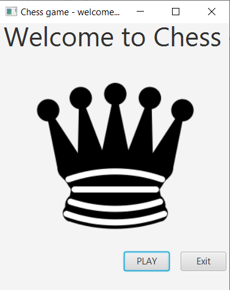
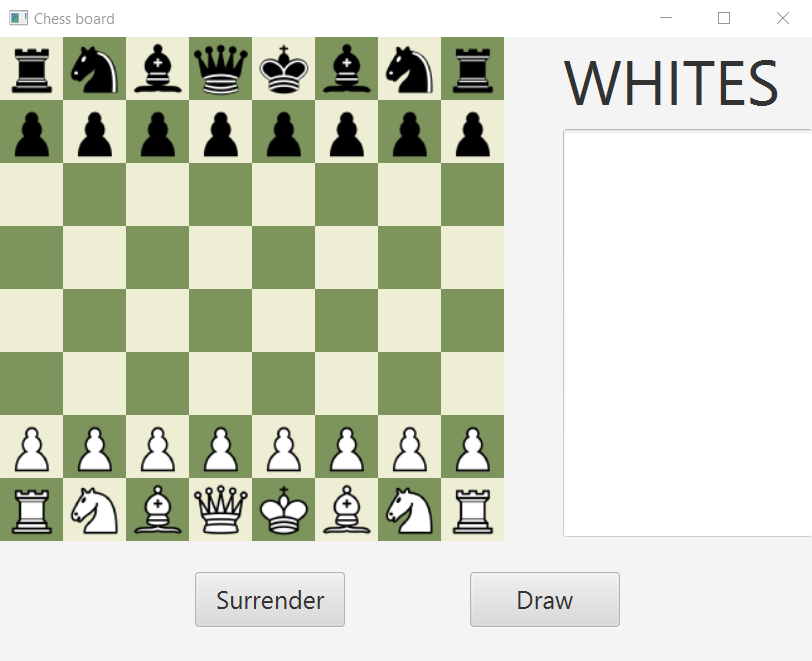
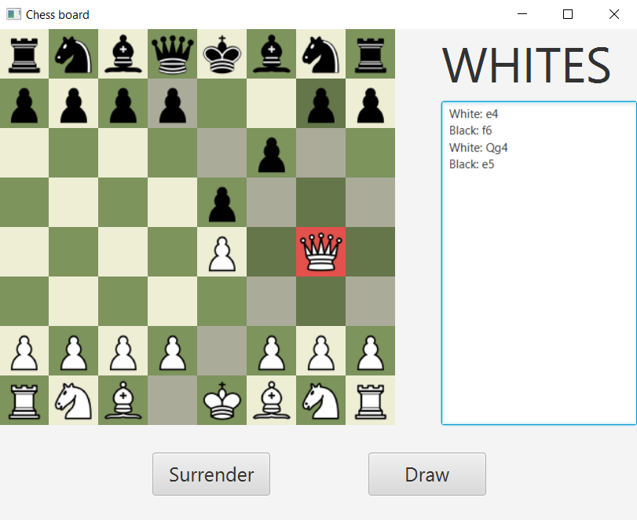
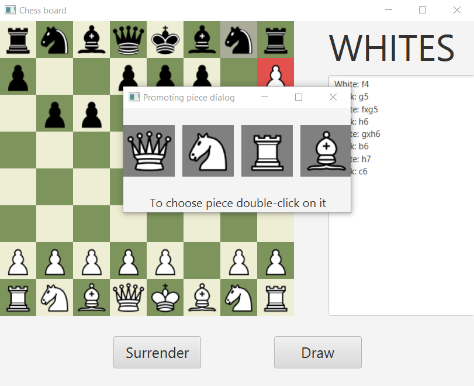
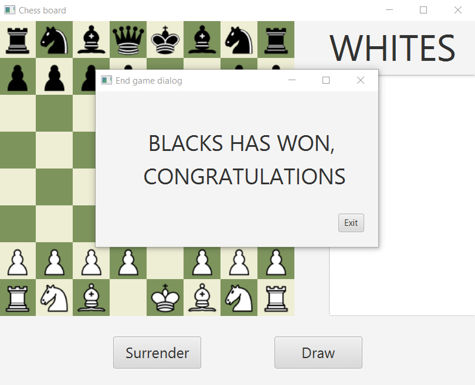
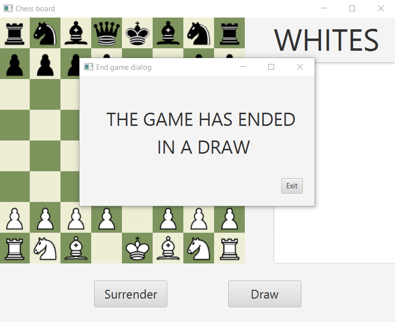

# Chess Game by Paweł Marszał 

My application, that allows two players to play chess

## How to run it

### Prerequisites

* Java 17
* JavaFX 17
* Maven

### Installation

Make sure you have set environmental variables JAVA_HOME and PATH_TO_FX.

Compile the app using `./mvnw package`, and after that you can run the game by:

```
java --module-path $PATH_TO_FX --add-modules javafx.controls,javafx.fxml -cp "chess-client/target/chess-client-1.0.jar:chess-model/target/chess-model-1.0.jar" com.pmarshall.chessgame.client.Main
```

---

## Logical Data Model

Main elements of logical data model are:

<ul>
    Pieces
</ul>
<ul>
    Moves
</ul>
<ul>
    Players
</ul>
<ul>
    Game object
</ul>

Game object binds other elements together and contains an array representing board.

### Some rules

My application implements all rules of chess, including:

* promotion of pawn on the last row

* double-length start of pawn

* capturing en-passant

* castling

Application validates all possible moves that can be taken at each moment in time,
so after picking a piece player sees only those that are possible without breaking the rules.

---

## Design patterns

I have used 2 design patterns in my project:

* MVC (Model-View-Controller) - to create GUI
  
* Command - to implement moves; it is necessary, because validating moves requires
simulating them and then rewinding them back
  
---

## GUI examples

### Welcome screen



### Initial layout of the game




### Making move



### Promotion

#### Promotion dialog



#### Game after promotion


### Victory notification screen



### Draw notification screen


