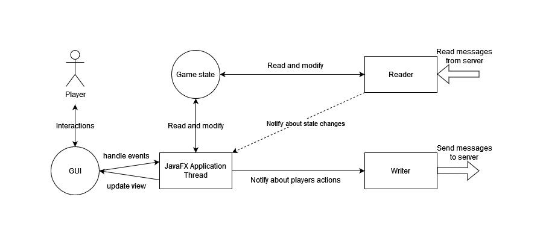
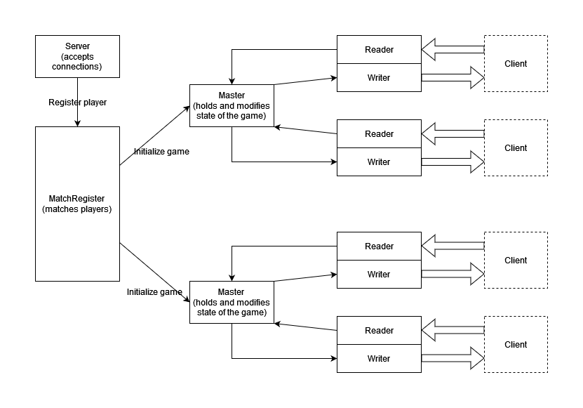

# Chess Game by Paweł Marszał 

The project implements server and client applications for local and remote multiplayer chess.
* Local mode uses one board shared by two people using one machine and does not require internet connection.
* Remote mode allows clients to play over network via server that ensures chess rules
and state integrity. 

### Motivation

The goal I have for this project is to learn and practice various concepts
that may be useful for Java programmer.
That includes:
* System design - I've had to decide which communication model to choose, how to organize
computation on server and client side, define interfaces between packages and modules etc.
* Multi-module Maven project
* Java modules
* JavaFX app structure and GUI design
* Building and running Docker images
* Packaging installable self-contained Java applications using `jpackage`
* Websockets - I've defined simple communication protocol over TCP sockets to allow bidirectional communication
* Network routing to self-host server using my personal public IP

---

### Technologies used

* Java 17
* JavaFX 17
* Maven
* Websockets
* Docker
* JPackage

### Build process

Only prerequisite is Java 17 installed.

Then to build the project use `./mvwn verify` on Linux or `.\mvwn.cmd verify` on Windows.
Maven wrapper will take care of downloading Maven and the rest of dependencies.

Afterwards, to create server's Docker image use script `./pmdocker` (on Linux environment).

Client app installer is created automatically and located in `chess-client/target/jpackage` directory.
Because `jpackage` tool doesn't support cross-platform builds Windows and/or Linux clients
need to be build on target platforms.

If environment variable `SERVER_ADDRESS` is specified during build process, it will be default
route that clients will try to connect to. Example of this variable looks like:
`SERVER_ADDRESS='127.0.0.1 11111'`.

Alternatively user can provide server's IP and port as command line arguments to client, like:
`.\windows-chess-client.exe 127.0.0.1 11111`.

### How to run it

Server can be run either directly (requires installation of Java) or as a docker container.

Client is standalone application. After you build the installer or download it from other source,
you can install it on your system and use like any other program.

---

## Architecture overview

### Communication protocol

Server and clients communicate using TCP Websockets.
Both server and clients use blocking synchronous I/O in dedicated threads.

Messages (Java objects) are parsed to JSON and then to byte arrays that can be sent
over the network.
To know how many bytes receiving side has to read, each messages is preceded by 2-bytes long
header containing length of the actual message.

### Computation model

* Client application threads

* Server application threads

---

## GUI examples

### Welcome screen

### Initial layout of the game

### Making move

### Promotion

#### Promotion dialog

#### Game after promotion

### Victory notification screen

### Draw notification screen

